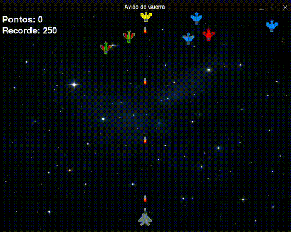

# ✈️ Avião de Guerra

Um jogo simples de avião de guerra onde você controla um avião e deve atirar nos inimigos que vêm de cima. Desenvolvido com auxílio de IA 🤖!

## 🎬 Demonstração



> Ou veja o vídeo completo em [assets/video.mp4](assets/video.mp4)

## 🚀 Sobre o Projeto

Este projeto foi criado como um experimento de aprendizado e diversão, com o apoio de uma Inteligência Artificial para acelerar o desenvolvimento, sugerir ideias e resolver problemas de código. A IA ajudou desde a estruturação inicial até detalhes de lógica e documentação!

## 🛠️ Requisitos

- Python 3.x
- Pygame

## ⚡ Instalação

1. Clone este repositório
2. Instale as dependências:
```bash
pip install -r requirements.txt
```

## 🎮 Como Jogar

Execute o jogo com:
```bash
python main.py
```

### 🎯 Controles
- ⬅️➡️ Setas Esquerda/Direita: Movimentar o avião
- Espaço: Atirar

## 🏆 Objetivo
Atire nos aviões inimigos (quadrados vermelhos) que vêm de cima da tela. Cada inimigo destruído vale pontos. 

---

Feito com 💙, Python, Pygame e IA! 